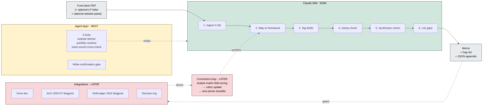

# Roadmap — VC fund evaluation primer system

The Skill in [`./skill/`](./skill/) is the deterministic core. This document is the system view — what the Skill plugs into, ordered by readiness.

## System diagram

**Read order:** the green core is what runs live. The yellow box is the agent layer the Skill grows into once the rubric is locked. The red box is what plugs the artifact into the firm's existing stack and the corrections loop that makes it compound.

## NOW — the Skill (shipped)

- Single Claude Skill. No tools, no loop, no state. Single LLM call, deterministic.
- Inputs: fund deck PDF (required), LP letter / AGM notes (optional), website content paste (optional).
- Outputs: ~600-word markdown memo (3 sections, one per core question) + numbered gap list + JSON appendix.
- Six steps: **Ingest** in full → **Map** to framework → **Tag** (value, source, confidence, counterfactual) → **Sanity-check** (cross-input consistency + metric stress-test) → **Synthesise** memo → **List** gaps.

## NEXT — agent layer wrapping the Skill (Some ideas)

- **Website fetcher tool.** Replaces the website paste — agent fetches fund site directly. Adds robustness for JS-heavy sites and authenticated pages.
- **Portfolio-company resolver tool.** For each named portfolio company in the deck, fetches public signals (Crunchbase, news APIs, last-round date) to stress-test the deck's "winners." Routes findings into the relevant `what_would_change_the_call` fields.
- **GP track-record cross-check tool.** Runs claimed exits against public exit databases (Pitchbook, Crunchbase). Downgrades confidence where the deck's headline metric doesn't reconcile.
- **Write-confirmation gate.** Before any output writes to a record system (Drive, Notion, internal record store), the agent surfaces what's about to change and waits for explicit confirmation. Same pattern as Sift and `personal-expense-hermes`.
- **Why agent layer, not bigger Skill:** these are I/O operations against external sources, not reasoning. They need retry, caching, and structured-error handling — the agent layer is the right place for that. The Skill stays the deterministic core; the agent wraps it with retrieval, validation, and the write path.
- **Validated by the Susa run.** The v1 Skill, run against the Susa Ventures IV deck (Q1 2021), correctly identified what was stale and routed it to the gap list — without pretending to verify it. The gap list explicitly named the verifications the agent layer would close (current state of Robinhood/Flexport/Stord/Viz.ai, realised vs marked-up returns). Closing those gaps is exactly the agent layer's job; the Skill's job is to identify them. See [`./examples/output/susa-iv.md`](./examples/output/susa-iv.md).

## LATER — corrections loop and integration edges (Some ideas)

- **Corrections-back-to-rubric loop.** When an analyst marks a Skill output wrong (e.g. confidence-tagged `high` but actually fragile), the correction flows back into the rubric — not just the individual run. The artifact compounds with use; the team isn't re-fighting the same calibration battle every primer.
- **Decision log.** Every primer + the analyst's final view + the eventual outcome become a row that compounds pattern recognition over time. *("This strategy looks like Fund X you passed on in 2024.")*
- **Integration edges with the existing stack:**
  - **Arch** — alt-investment context post-decision. Skill outputs feed forward into ongoing oversight.
  - **dbt models** — fund-level rollups for the portfolio team.
  - **SoftLedger** — if any structured fund data should land in the GL post-investment, the JSON appendix is the API surface.
- **Adjacent artifacts (named, not detailed):**
  - **Post-call retrospective Skill** — different shape, different prompt, runs after the call to capture the team's working view alongside the document-derived primer.
  - **Public-equity primer** — same loop, different inputs and framework. Natural home is the factor-tilted equity work the team has already written about.
  - **Ledger-synergy primer** — variant for direct private investments where DD requires comparing the target's books to a portfolio company's. Closest analog to the M&A ledger-comparison skill from the receipt.
